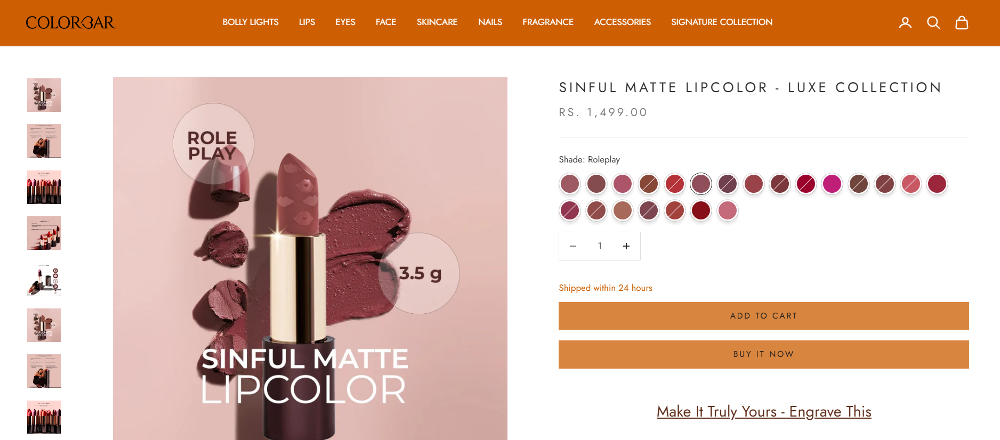
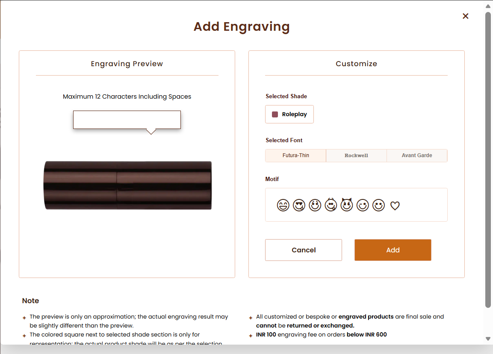
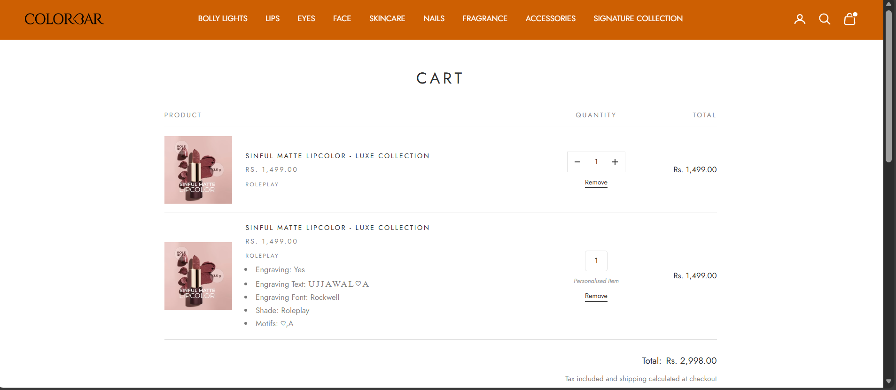
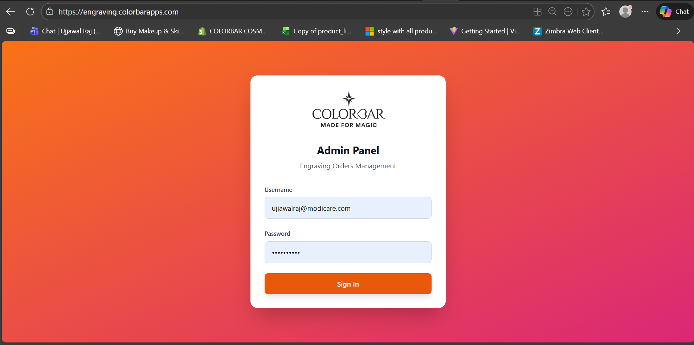
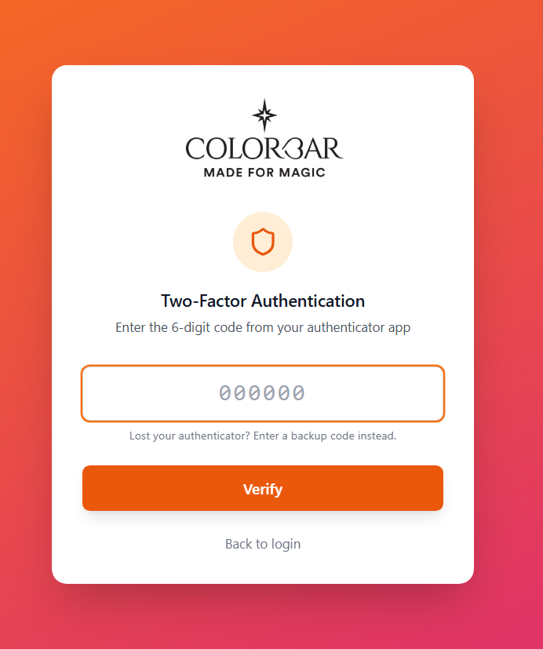
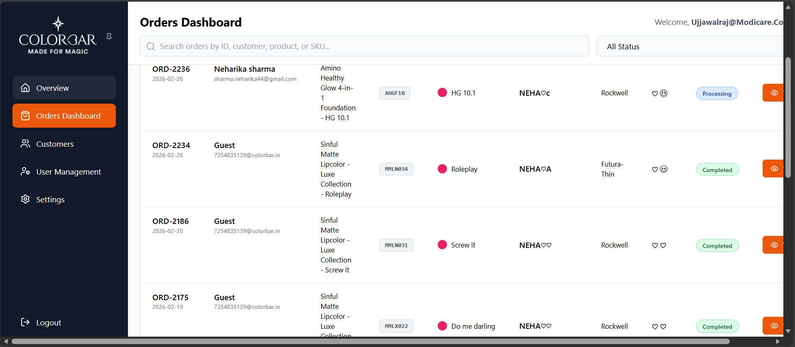
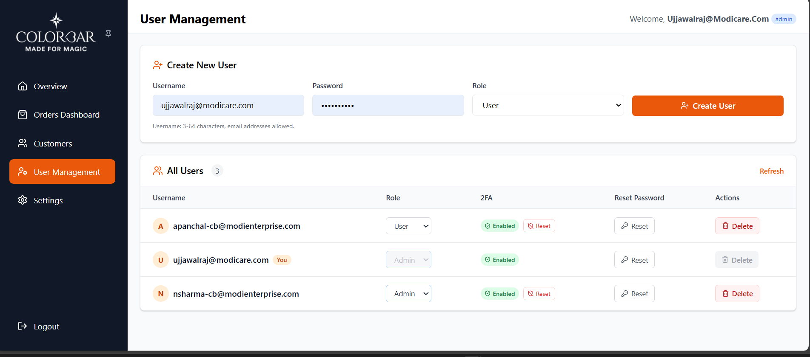
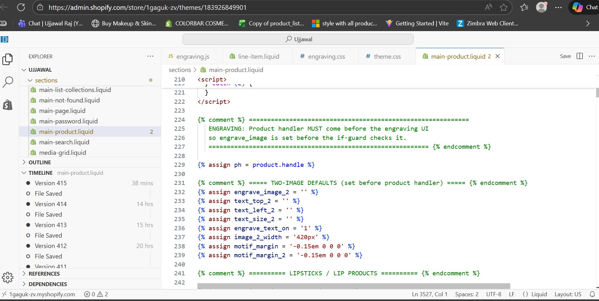
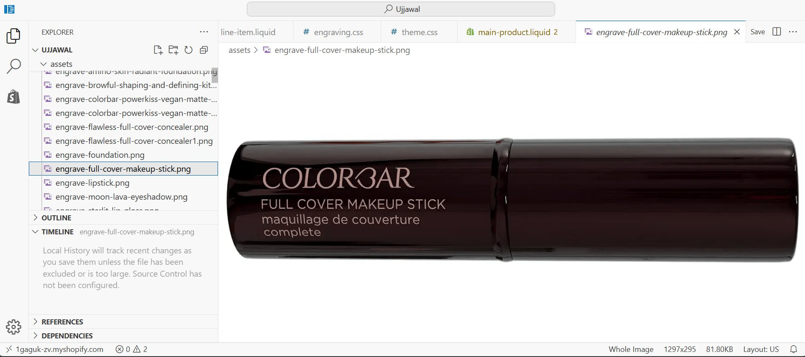

# Colorbar Cosmetics - Product Engraving & Order Management System

> **End-to-end personalization platform** for India's premium cosmetics brand [Colorbar](https://colorbarcosmetics.com) — custom Shopify storefront engraving experience + full-stack admin dashboard for engraving order operations.

**Live Production:** [engraving.colorbarapps.com](https://engraving.colorbarapps.com)

---

## Table of Contents

- [Project Overview](#project-overview)
- [Key Highlights](#key-highlights)
- [System Architecture](#system-architecture)
- [Storefront — Shopify Engraving Customization](#storefront--shopify-engraving-customization)
- [Admin Dashboard — Engraving Order Management](#admin-dashboard--engraving-order-management)
- [Screenshots & Demo](#screenshots--demo)
- [Tech Stack](#tech-stack)
- [Project Structure](#project-structure)
- [Getting Started](#getting-started)
- [API Documentation](#api-documentation)
- [Security Implementation](#security-implementation)
- [Challenges & Solutions](#challenges--solutions)

---

## Project Overview

Colorbar Cosmetics wanted to offer **personalized engraving** on their premium product line (lipsticks, foundations, concealers, eyeshadows — 135+ SKUs). This project delivers:

1. **Shopify Storefront Customization** — A seamless engraving UI embedded directly into the product page, cart drawer, and checkout flow using Shopify Liquid templates + custom JavaScript.

2. **Admin Dashboard** — A production-grade React + Node.js application that connects to Shopify's REST API, pulls engraving orders in real-time, and lets the operations team track, manage, and fulfill personalized orders with full visibility.

### Business Impact
- Enabled a **new premium revenue stream** through product personalization
- Reduced order processing time by providing a **dedicated engraving operations dashboard**
- **Zero-downtime deployment** — both systems run in production at scale
- Handles **135+ product variants** with pixel-perfect engraving preview positioning

---

## Key Highlights

| Area | What I Built |
|------|-------------|
| **Shopify Liquid/JS** | Custom engraving modal with real-time preview, font selection, motif symbols, shade-aware rendering — integrated into product page, cart drawer, and full cart |
| **React Dashboard** | 11-component admin SPA with order tracking, customer management, user administration, and XLSX export |
| **Node.js API** | Express server with Shopify REST API integration, order filtering, status management, and email notifications |
| **Authentication** | Token-based auth with **mandatory TOTP 2FA**, backup codes, rate limiting, session management — no localStorage (memory-only tokens) |
| **Real-time Sync** | 30-second polling with smart order detection, automatic Shopify tag updates, and email alerts for new engraving orders |
| **Product Mapping** | 135+ product handle configurations with precise CSS positioning for engraving text overlay on product images |

---

## System Architecture

```
┌─────────────────────────────────────────────────────────────────────┐
│                        COLORBAR COSMETICS                           │
│                    Product Engraving Platform                       │
└─────────────────────────────────────────────────────────────────────┘

┌──────────────────────┐         ┌──────────────────────────────────┐
│   SHOPIFY STORE      │         │   ADMIN DASHBOARD                │
│   colorbar.in        │         │   engraving.colorbarapps.com     │
│                      │         │                                  │
│  ┌────────────────┐  │         │  ┌────────────┐ ┌─────────────┐ │
│  │ Product Page   │  │         │  │ React SPA  │ │ Express API │ │
│  │ + Engraving UI │  │         │  │ (Frontend) │ │ (Backend)   │ │
│  │ + Live Preview │  │         │  │            │ │             │ │
│  └───────┬────────┘  │         │  │ - Overview │ │ - Orders    │ │
│          │           │         │  │ - Orders   │ │ - Customers │ │
│  ┌───────▼────────┐  │         │  │ - Users    │ │ - Auth/2FA  │ │
│  │ Cart Drawer    │  │         │  │ - Settings │ │ - Email     │ │
│  │ + Engrave Info │  │         │  └─────┬──────┘ └──────┬──────┘ │
│  └───────┬────────┘  │         │        │               │        │
│          │           │         │        └───────┬───────┘        │
│  ┌───────▼────────┐  │         │                │                │
│  │ Full Cart Page │  │         └────────────────┼────────────────┘
│  │ + Engrave Info │  │                          │
│  └────────────────┘  │                          │
│                      │         ┌────────────────▼────────────────┐
└──────────┬───────────┘         │      SHOPIFY REST API           │
           │                     │      (2025-01 Version)          │
           └─────────────────────│                                 │
             Orders with         │  - GET /orders.json             │
             engraving           │  - GET /customers.json          │
             properties          │  - PUT /orders/{id}.json        │
                                 └─────────────────────────────────┘
                                              │
                                 ┌────────────▼────────────────────┐
                                 │      EMAIL NOTIFICATIONS        │
                                 │      (Office 365 SMTP)          │
                                 │                                 │
                                 │  Auto-alerts for new engraving  │
                                 │  orders to operations team      │
                                 └─────────────────────────────────┘
```

---

## Storefront — Shopify Engraving Customization

### What It Does

Customers can personalize their Colorbar products with custom engraving directly on the product page:

- **Text Input** — Up to 12 characters (auto-uppercase, sanitized)
- **Font Selection** — Futura-Thin, Rockwell, or Avant Garde
- **Motif Symbols** — 11 special emoticon characters rendered via custom font
- **Shade-Aware** — Engraving preview respects the selected product shade/color
- **Live Preview** — Real-time rendering of engraved text on actual product image
- **Cart Integration** — Engraving details passed as line item properties, quantity locked to 1, displayed throughout checkout flow

### Files Modified

| File | Purpose |
|------|---------|
| `shopify-customization/assets/engraving.js` | Core engraving UI logic — modal management, text input, font/motif selection, form submission |
| `shopify-customization/sections/main-product.liquid` | Product page template — 135+ product handle mappings with CSS positioning for engraving overlay |
| `shopify-customization/sections/cart-drawer.liquid` | Mini-cart — engraving display, quantity lock, loyalty points integration |
| `shopify-customization/sections/main-cart.liquid` | Full cart page — engraving details, "Personalised Item" label, checkout flow |
| `shopify-customization/snippets/line-item.liquid` | Line item component — motif placeholder replacement (`#emo1#` → emoticon spans) |

### How Engraving Data Flows

```
Product Page                    Cart                         Shopify Order
─────────────                  ────                         ─────────────
User selects:                  Line item properties:        Order note_attributes:
  - Text: "NEHA"                 - Engraving: Yes             - Engraving: Yes
  - Font: Rockwell               - Engraving Text: NEHA♡A    - Engraving Text: NEHA♡A
  - Motifs: ♡, A                 - Engraving Font: Rockwell  - Font: Rockwell
  - Shade: Roleplay              - Shade: Roleplay           - Shade: Roleplay
                                 - Motifs: ♡,A               - Motifs: ♡,A
        ──────────►                    ──────────►
      Add to Cart                   Place Order
```

---

## Admin Dashboard — Engraving Order Management

A complete **React + Node.js admin panel** deployed at [engraving.colorbarapps.com](https://engraving.colorbarapps.com) for the operations team to manage engraving orders.

### Features

#### Orders Dashboard
- Real-time order feed from Shopify (30-second polling)
- **Smart filtering** — automatically extracts only engraving orders from all Shopify orders
- Search by Order ID, customer name, product, or SKU
- Status workflow: `Pending → Processing → Completed`
- Status changes sync back to Shopify as order tags (`dashboard-pending`, `dashboard-processing`, `dashboard-completed`)
- Engraving preview with accurate product image + text overlay positioning

#### User Management (Admin)
- Create/delete users with role assignment (Admin / User)
- Reset passwords and 2FA for team members
- Role-based access control enforcement

#### Customer View
- Customer directory with contact details
- Order history and order count per customer

#### Settings & Export
- Profile management (display name, email)
- Password change with current password verification
- TOTP 2FA setup/disable with QR code
- **XLSX export** of orders and customer data

#### Email Notifications
- Automatic email alerts when new engraving orders are detected
- HTML-formatted email with order details table
- Configurable recipient list
- Smart throttling — only alerts for orders less than 10 minutes old

---

## Screenshots & Demo

### Storefront — Product Page with Engraving CTA
The "Make It Truly Yours - Engrave This" call-to-action on the product page:



### Storefront — Engraving Modal
Interactive modal with real-time preview, font selection, and motif picker:



### Storefront — Engraving Preview with Text & Motifs
Live preview showing engraved text rendered on the actual product image:


### Storefront — Cart with Engraved Items
Engraving details displayed in cart — quantity locked to 1 with "Personalised Item" label:



### Admin — Login & Two-Factor Authentication
Secure login with mandatory TOTP 2FA:

| Login Page | 2FA Verification |
|:---:|:---:|
|  |  |

### Admin — Orders Dashboard
Real-time engraving order management with search, filtering, and status tracking:



### Admin — User Management
Admin interface for team member management with role control and 2FA administration:



### Development — Shopify Theme Editor
Working directly in the Shopify theme code editor with engraving integration:

| Theme Code Editor | Engraving Assets |
|:---:|:---:|
|  |  |

---

## Tech Stack

### Shopify Storefront
| Technology | Purpose |
|-----------|---------|
| **Shopify Liquid** | Template engine for product pages, cart, and checkout |
| **Vanilla JavaScript** | Engraving modal, text input, live preview, form handling |
| **Custom Font (Emoticons TTF)** | Special motif/symbol rendering via Shopify CDN |
| **Shopify REST API 2025-01** | Order data, customer data, tag management |

### Admin Dashboard — Frontend
| Technology | Version | Purpose |
|-----------|---------|---------|
| **React** | 19.x | UI framework |
| **Tailwind CSS** | 3.4.x | Utility-first styling |
| **Lucide React** | 0.563.x | Icon library |
| **XLSX** | 0.18.x | Excel/CSV export |

### Admin Dashboard — Backend
| Technology | Version | Purpose |
|-----------|---------|---------|
| **Node.js + Express** | 4.22.x | REST API server |
| **Axios** | 1.13.x | HTTP client for Shopify API |
| **bcryptjs** | 3.0.x | Password hashing |
| **otpauth** | 9.5.x | TOTP generation & validation |
| **qrcode** | 1.5.x | QR code for 2FA setup |
| **nodemailer** | 8.0.x | Email notifications (Office 365 SMTP) |
| **helmet** | 8.1.x | Security headers |
| **cors** | 2.8.x | Cross-origin resource sharing |

---

## Project Structure

```
colorbar-engraving-platform/
│
├── README.md                              # This file
├── .gitignore                             # Git ignore rules
│
├── shopify-customization/                 # Shopify theme modifications
│   ├── assets/
│   │   └── engraving.js                   # Core engraving UI (modal, preview, form)
│   ├── sections/
│   │   ├── main-product.liquid            # Product page (135+ product handlers)
│   │   ├── cart-drawer.liquid             # Mini-cart with engraving display
│   │   └── main-cart.liquid               # Full cart page with engraving details
│   └── snippets/
│       └── line-item.liquid               # Line item with motif rendering
│
├── admin-dashboard/                       # React + Node.js admin panel
│   ├── src/
│   │   ├── App.js                         # Main app — routing, order polling
│   │   ├── index.js                       # React entry point
│   │   ├── index.css                      # Global styles
│   │   ├── assets/
│   │   │   └── colorbar-logo.png          # Brand logo
│   │   ├── components/
│   │   │   ├── LoginPage.js               # Two-step login + 2FA setup
│   │   │   ├── EngravingPreview.js        # Product image + text overlay
│   │   │   ├── OrderDetailModal.js        # Order detail view
│   │   │   ├── OrdersView.js             # Orders table with search/filter
│   │   │   ├── OverviewView.js           # Dashboard stats & metrics
│   │   │   ├── CustomersView.js          # Customer directory
│   │   │   ├── UserManagementView.js     # Admin user CRUD
│   │   │   ├── SettingsView.js           # Profile, 2FA, export
│   │   │   ├── Sidebar.js                # Collapsible navigation
│   │   │   ├── ColorbarLogo.js           # Logo component
│   │   │   └── ErrorBoundary.js          # Error fallback UI
│   │   ├── constants/
│   │   │   ├── config.js                  # App version config
│   │   │   └── productHandlers.js         # 135+ product CSS mappings
│   │   ├── context/
│   │   │   └── AuthContext.js             # Auth state management
│   │   └── utils/
│   │       └── statusColors.js            # Status color mappings
│   ├── backend/
│   │   ├── server.js                      # Express API server (~930 lines)
│   │   ├── db.js                          # JSON file persistence layer
│   │   ├── package.json                   # Backend dependencies
│   │   └── .env.example                   # Environment variable template
│   ├── public/
│   │   ├── index.html                     # HTML template
│   │   └── ...                            # Static assets
│   ├── package.json                       # Frontend dependencies
│   ├── tailwind.config.js                 # Tailwind configuration
│   └── postcss.config.js                  # PostCSS configuration
│
└── docs/
    └── screenshots/                       # Project screenshots (15 images)
        ├── 01-shopify-theme-editor.png
        ├── 04-product-page-with-engraving.png
        ├── 06-engraving-modal-empty.png
        ├── 08-engraving-with-text-preview.png
        ├── 09-cart-with-engraved-items.png
        ├── 11-admin-orders-dashboard.png
        ├── 12-admin-user-management.png
        ├── 14-admin-login-production.png
        ├── 15-admin-2fa-authentication.png
        └── ...
```

---

## Getting Started

### Prerequisites
- Node.js 18+
- npm 9+
- Shopify Partner account (for storefront development)

### Admin Dashboard Setup

```bash
# Clone the repository
git clone https://github.com/yourusername/colorbar-engraving-platform.git
cd colorbar-engraving-platform

# Setup backend
cd admin-dashboard/backend
npm install
cp .env.example .env          # Configure your environment variables
node server.js                # Starts on http://localhost:5000

# Setup frontend (in a new terminal)
cd admin-dashboard
npm install
npm start                     # Starts on http://localhost:3000
```

### Shopify Theme Integration

1. Open your Shopify admin → **Online Store** → **Themes** → **Edit Code**
2. Upload `engraving.js` to the **Assets** folder
3. Replace/merge the Liquid templates into your theme's corresponding files
4. Upload product engraving images with `engrave-{product-handle}.png` naming convention
5. Upload the `emoticons.ttf` custom font to Assets

---

## API Documentation

### Authentication Endpoints
| Method | Endpoint | Description |
|--------|----------|-------------|
| `POST` | `/api/auth/login` | Step 1: Username/password → pending token (5-min TTL) |
| `POST` | `/api/auth/verify-2fa` | Step 2: TOTP code → session token (8-hour TTL) |
| `POST` | `/api/auth/change-password` | Change password (requires current password) |
| `GET` | `/api/auth/profile` | Get current user profile |
| `PUT` | `/api/auth/profile` | Update display name, email |
| `POST` | `/api/auth/logout` | Invalidate session |

### TOTP / 2FA Endpoints
| Method | Endpoint | Description |
|--------|----------|-------------|
| `GET` | `/api/auth/totp/status` | Check 2FA status |
| `POST` | `/api/auth/totp/setup` | Generate TOTP secret + QR code |
| `POST` | `/api/auth/totp/verify-setup` | Confirm setup, generate 8 backup codes |
| `DELETE` | `/api/users/:username/totp` | Admin: reset user's 2FA |

### Order Endpoints
| Method | Endpoint | Description |
|--------|----------|-------------|
| `GET` | `/api/orders` | Fetch engraving-only orders (filtered) |
| `GET` | `/api/orders/all` | Fetch all orders |
| `GET` | `/api/orders/:id` | Get single order details |
| `PUT` | `/api/orders/:id` | Update order status + sync to Shopify tags |

### User Management (Admin Only)
| Method | Endpoint | Description |
|--------|----------|-------------|
| `GET` | `/api/users` | List all users |
| `POST` | `/api/users` | Create new user |
| `PUT` | `/api/users/:username/role` | Change user role |
| `PUT` | `/api/users/:username/password` | Reset user password |
| `DELETE` | `/api/users/:username` | Delete user |

---

## Security Implementation

This project implements **enterprise-grade security** suitable for production use:

| Feature | Implementation |
|---------|---------------|
| **Mandatory 2FA** | All users must set up TOTP on first login — no bypass |
| **No localStorage** | Tokens held in React state only — cleared on page refresh |
| **Two-step login** | Password → pending token (5 min) → TOTP → session token (8 hr) |
| **Backup codes** | 8 single-use recovery codes, bcrypt-hashed in database |
| **Rate limiting** | Max 10 login attempts per 15 minutes per username+IP |
| **Session cleanup** | Automatic expiry every 8 hours, cleanup sweep every 15 minutes |
| **Password hashing** | bcrypt with salt rounds for all stored passwords |
| **Security headers** | Helmet.js for HSTS, X-Frame-Options, CSP, etc. |
| **Role-based access** | Admin vs User roles with server-side enforcement |
| **CORS policy** | Configured allowed origins for frontend-backend communication |

---

## Challenges & Solutions

### 1. Pixel-Perfect Engraving Preview Across 135+ Products
**Challenge:** Each Colorbar product has a different shape, size, and engraving surface area. Text positioning had to be pixel-perfect on every product image.

**Solution:** Built a comprehensive product handler mapping system (`productHandlers.js`) with individual CSS coordinates (`text_top`, `text_left`, `font_size`) for each product handle. Supports dual-image products (e.g., lipstick cap + body) with separate text placements.

### 2. Custom Motif/Emoji Rendering
**Challenge:** Engraving symbols (hearts, stars, smileys) needed to render consistently across all browsers and in the cart/checkout flow where Shopify's Liquid templates are used.

**Solution:** Created a custom `emoticons.ttf` font file hosted on Shopify CDN. Built a placeholder system (`#emo1#` through `#emo9#`) that maps to font characters. The `line-item.liquid` snippet replaces placeholders with styled `<span>` elements using the custom font.

### 3. Cart Quantity Lock for Personalized Items
**Challenge:** Engraved items are one-of-a-kind and cannot be duplicated. Users should not be able to increase quantity of an engraved item.

**Solution:** Modified both `cart-drawer.liquid` and `main-cart.liquid` to detect engraving properties on line items. When detected, the quantity selector is hidden, quantity is locked to 1, and a "Personalised Item" label is displayed.

### 4. Secure Token Management Without localStorage
**Challenge:** Storing auth tokens in localStorage is a known XSS vulnerability vector. Needed secure token handling for the admin dashboard.

**Solution:** Implemented memory-only token storage in React state via Context API. Tokens are never persisted to disk — cleared on page refresh. Combined with mandatory TOTP 2FA, this provides strong session security.

### 5. Smart Engraving Order Detection
**Challenge:** The Shopify store has thousands of orders — the admin dashboard should only show engraving orders, not all orders.

**Solution:** Built an intelligent order filtering system in the backend that inspects line item properties for engraving indicators (text, font, motifs). Orders are scanned using case-insensitive property matching to handle variations in how Shopify stores custom properties.

---

## Author

**Ujjawal Raj**
- Role: Full-Stack Developer at Modi Enterprises (Colorbar Cosmetics)
- Email: ujjawalraj@modicare.com
- Built & deployed: February 2026

---

## License

This project was built for **Colorbar Cosmetics (Modi Enterprises)**. Source code is shared for portfolio/demonstration purposes.
